##Pythagorea解法
apple app store里Pythagorea游戏的解法，低难度题目略。

####§ 6.3
画直线等分两个矩形  
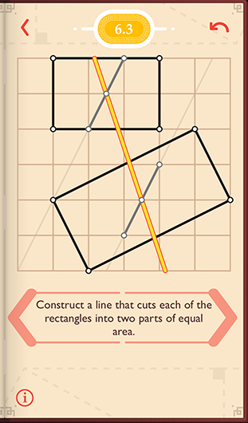

####§ 6.10
过节点A画垂线  
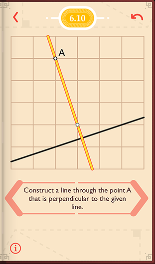

####§ 6.12
给定一条边和对面中点A，画平行四边形  
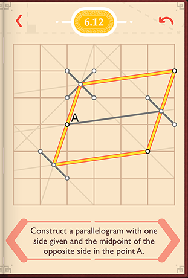

####§ 6.18
2/5处画点  
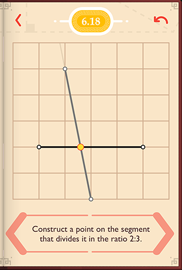

####§ 6.19
找出和A节点距离为5的节点。偏移A节点3行4列处的点，距离也为5。勾3股4弦5   
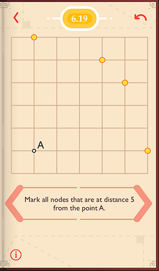

####§ 7.2
过节点A画角平分线，中线和顶垂线  
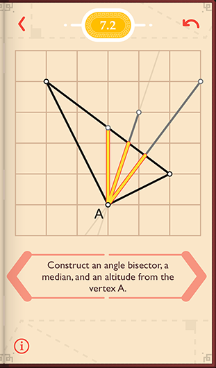

####§ 7.3
过A画两条直线3使矩形面积3等分  
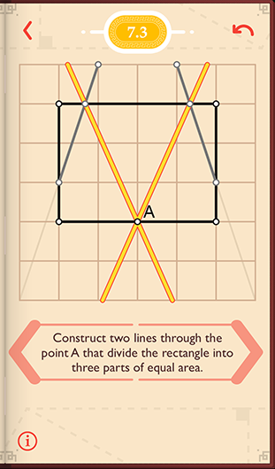

####§ 7.6
画45度角  
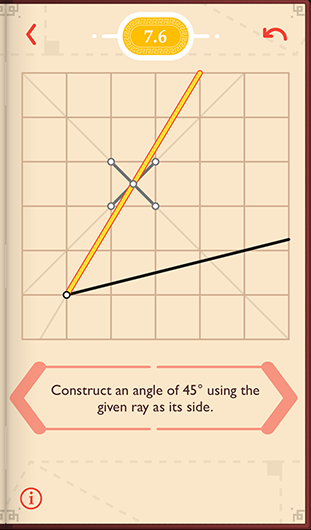

####§ 7.9
画出所有顶垂线  
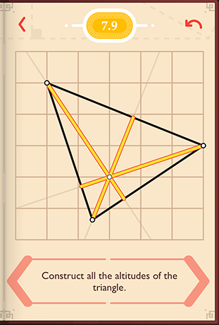

####§ 7.13
在线上画一点，到给定的两点距离一样  
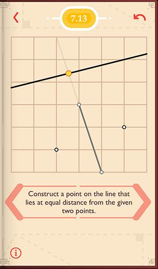

####§ 7.21
画出所有的过C点，并且距离AB相等的线  
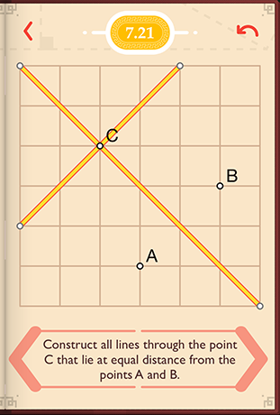

####§ 8.1
找中点，Y轴3个单位，中点在Y轴1.5单位处  
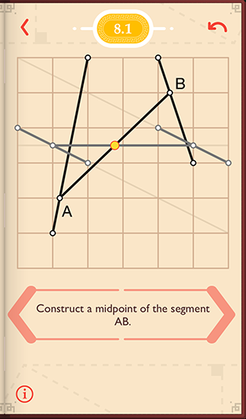

####§ 8.4
给定2个顶点画正方型  
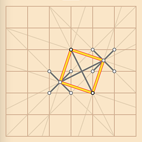

####§ 8.7
给定一条边和对边的中点，画平行四边型  
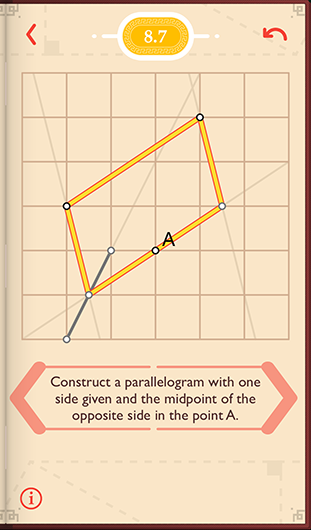

####§ 8.8
在线段5分之2处画点  
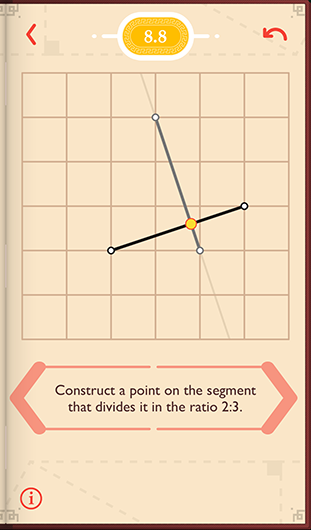

####§ 8.10
画垂分线  
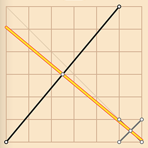

####§ 8.12
过C点画线，要求直线距离AB相等。一条过C的平等线，和一条过C的平分线。  
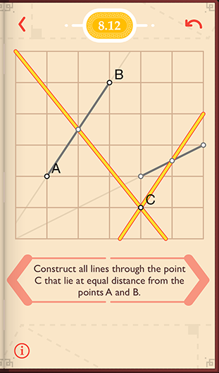

####§ 8.13
三分线段  
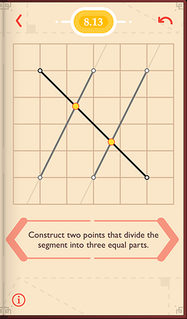

####§ 8.14
标注出和A点距离为根号5的节点  
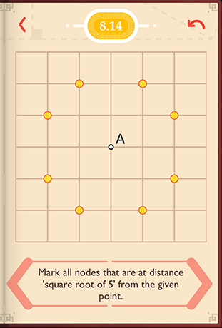

####§ 8.17
角平分线  
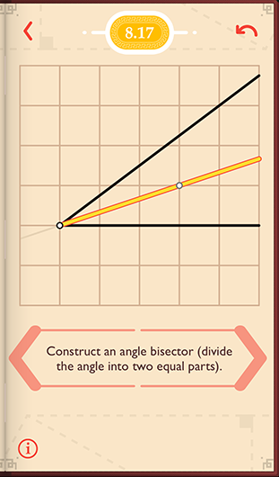

####§ 8.18
角平分线，先画个正方型，对角线就是答案  
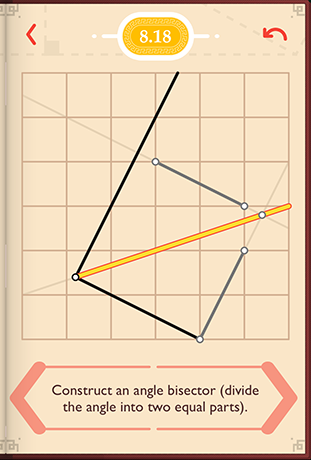

####§ 8.19
找到垂分线的交点（重心）  
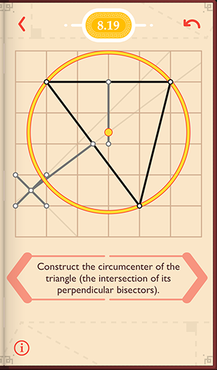

####§ 8.22
给定线段的中点，画正方形  
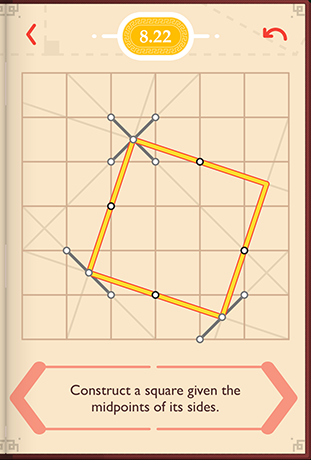

####§ 8.28
在射线上，标注距离A点1个单位的点  
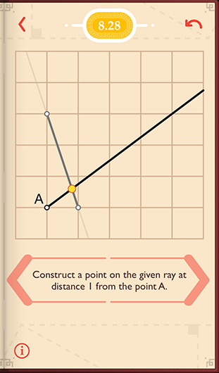

####§ 8.29
中点，斜边高2又1/3，中点在Y轴1又1/6处  
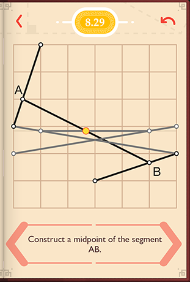

####§ 9.2
找出所有可以连接线段后呈90度角的点  
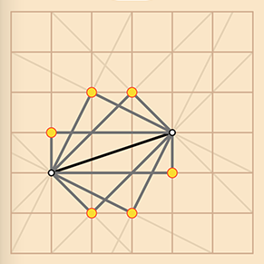

####§ 9.4
角平分线，画等腰梯形作中线  
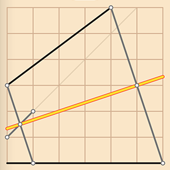

####§ 9.5
所有共切线  
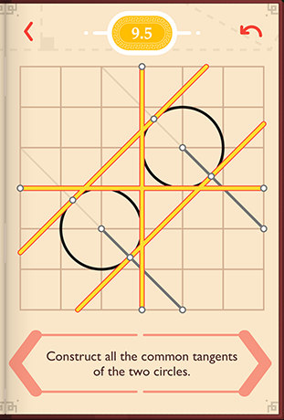

####§ 9.8
过A作垂线  
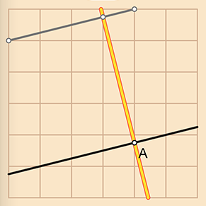

####§ 9.9
过A作平行线  
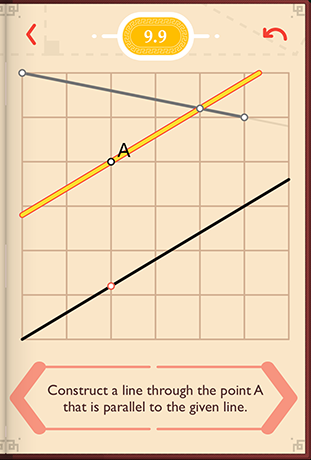

####§ 9.10
角平分线，画正方形连接对角线  
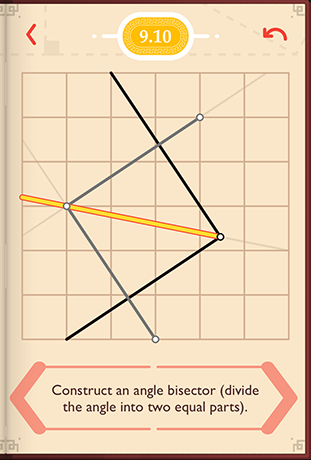

####§ 9.11
找出外心，中垂线交点  
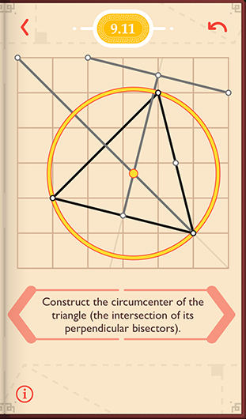

####§ 9.12
过C画线，线和AB等距离
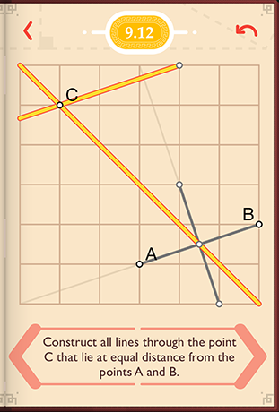

####§ 9.13
垂分线，找出中点，将端点绕中点转90度  
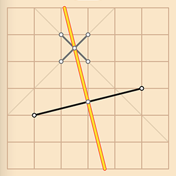

####§ 9.14
内心，角平分线交点  
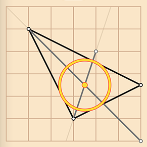

####§ 9.21
切线，找出和连接切点和直径90度的直径，作平行线  
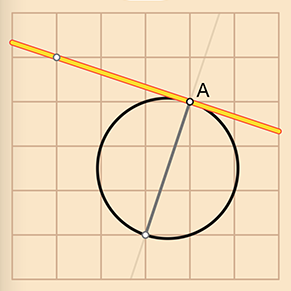

